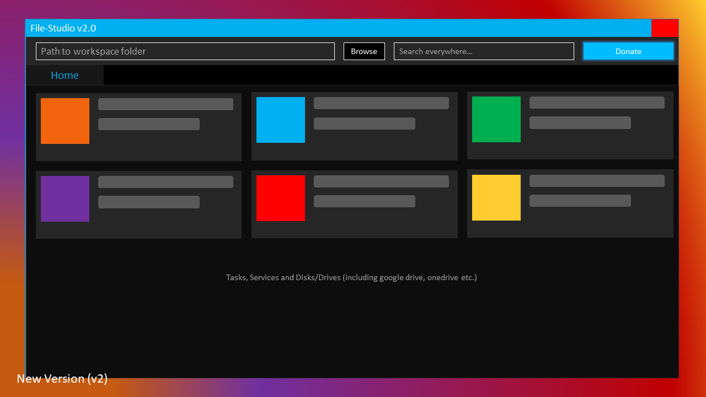
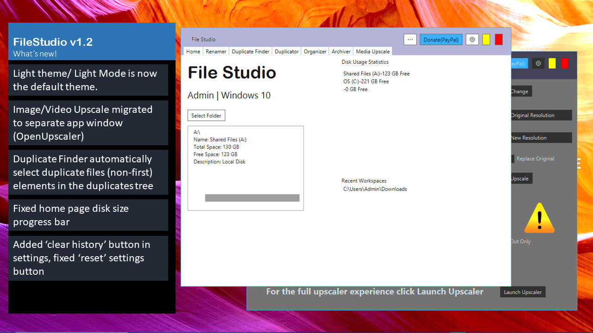

[](https://app.codacy.com/gh/abummoja/File-Studio/dashboard?utm_source=gh&utm_medium=referral&utm_content=&utm_campaign=Badge_grade)
[](https://sourceforge.net/projects/filestudio/files/latest/download)
[](https://sourceforge.net/projects/filestudio/files/latest/download)

Currently working on the NewUi for ```v2.0```
<br/>

File Studio handles advanced file operations<br/>
## Libraries Used
```
- gson 2.8.6
- zstd jni 1.5.6-4
- img scalr (4.2)
- xz (tukaani.xz) 1.10
- apache commons compress 1.25 (with javadoc jar)
- json (org.json) [optional]
- json-smart 2.x
- json-path 2.x
- JMetro (8.6.14)
- jFoenix (8.0.10)
```

| Test Libraries|
| --------|
| testng-6.14.3|
| jcommander-1.78|

```
- bulk renaming
- organizing folders
- image upscale
- video upscale
- duplicate finder
- file compression
- archiving directories
- disk compression
- disk scanner
- formatting disk
```
<br/>

- Custom GUI
<br/>

# Development
- Java 8
- Java fx
- Ant
- Netbeans(configure for your IDE)
- Scene Builder (optional)
