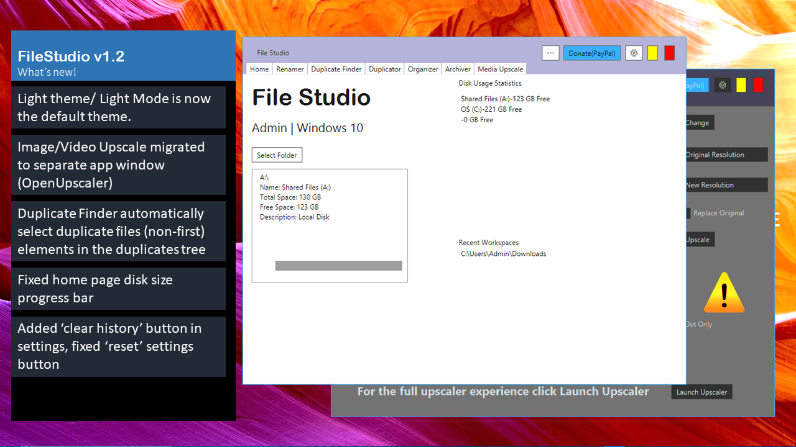
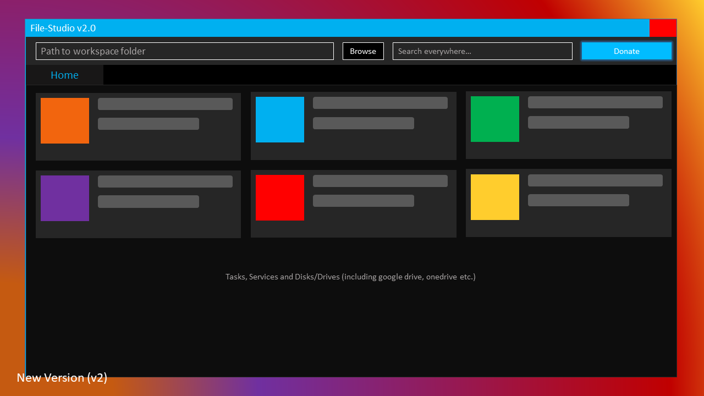

# File Studio

[](https://app.codacy.com/gh/abummoja/File-Studio/dashboard?utm_source=gh&utm_medium=referral&utm_content=&utm_campaign=Badge_grade)  
[](https://sourceforge.net/projects/filestudio/files/latest/download)  
[](https://sourceforge.net/projects/filestudio/files/latest/download)

---

## Product Overview

File Studio is a robust and versatile desktop application developed in Java, engineered to streamline and enhance file management tasks for end-users and professionals alike. Featuring an intuitive and customizable graphical user interface, File Studio empowers users to efficiently perform complex file operations with ease and precision.

The application supports a comprehensive suite of functionalities including bulk file renaming, folder organization, duplicate file detection and removal, file compression and archiving, disk scanning and formatting, as well as media upscaling capabilities. With dual UI modes—classic and modern Metro style—alongside theme customization and drag-and-drop support, File Studio delivers a seamless and productive user experience.

---

## Key Features

- **Bulk File Renaming:** Efficiently rename multiple files by replacing specified substrings within filenames.
- **Folder Organization:** Automatically organize files by filtering and relocating them based on file extensions.
- **Duplicate File Finder:** Detect and manage duplicate files with options for automatic selection and deletion.
- **Media Upscaling:** Enhance image and video quality through advanced upscaling algorithms (feature under development).
- **File Compression & Archiving:** Compress files and archive directories to optimize storage.
- **Disk Utilities:** Perform disk compression, scanning, and formatting operations.
- **Customizable User Interface:** Choose between classic and Metro-style UI with dark and light themes.
- **Drag-and-Drop Support:** Simplify file and folder input via intuitive drag-and-drop functionality.
- **Automatic Update Notifications:** Stay up-to-date with built-in update checking and notification system.
- **Cross-Platform Compatibility:** Built on Java 8 and JavaFX, ensuring broad platform support.

---

## Tools

- NetBeans, Ant (included with netbeans), Java 8, JavaFX (included with java 8)
- Libraries included in the ```lib/``` folder

---

## Testing Frameworks

- TestNG 6.14.3
- JCommander 1.78

---

## Installation Guide

1. Ensure Java 8 or higher is installed on your system.
2. Download the latest stable release from the [SourceForge File Studio project page](https://sourceforge.net/projects/filestudio/files/latest/download).
3. Extract the downloaded package if necessary.
4. Launch the application via the executable or command line using the provided scripts or JAR files.

---

## Getting Started

- Launch File Studio to open the main graphical interface.
- Utilize drag-and-drop to add files or directories for processing.
- Access dedicated modules for tasks such as renaming, organizing, and duplicate detection.
- Customize application settings through the preferences UI.
- Check for software updates automatically or manually within the application.

---

## Development Environment

- Developed using Java 8 and JavaFX.
- Build system: Apache Ant.
- Recommended IDE: NetBeans (project files included).
- Optional: Scene Builder for FXML UI design.
- Source code is modularized under the `src/filestudio` directory.

---

## Contribution Guidelines

We welcome contributions from the community. To contribute:

1. Fork the repository.
2. Create a feature or bugfix branch.
3. Commit changes with clear, descriptive messages.
4. Thoroughly test your modifications.
5. Submit a pull request for review.

Please follow the existing coding standards and project conventions.

---

## Visuals

  


---

## License

This project is licensed under the terms outlined in the LICENSE file.

---

## Support & Contact

For support, feature requests, or bug reports, please open an issue on the GitHub repository or contact the maintainer directly.

